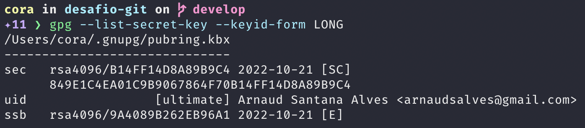

# Curso de Git

> ## Menu
>
>
> - [Home](README.md)
> - [Git Flow](#git-flow)
> - [Assinatura Digital](#assinatura-digital)
> - [PRs e Code Review](#prs-e-code-review)

---

### Git Flow

#### **Instalando o plugin para trabalhar com Git Flow**

As instruções de instalação do plugin git flow estão nesta [página](https://github.com/petervanderdoes/gitflow-avh/wiki/Installation).

#### **Instalando no Mac OS X**

```console
brew install git-flow-avh
```

Após instalar o gnu-getopt

```console
brew install gnu-getopt
```

#### **Inicializando um projeto com git e git flow**

```console
git init
```

Inicializar git flow

```console
git flow init
```

Após o comando de init devemos configurar as branches de feature, release, hotfix e bugfix, veja o exemplo na imagem.


#### **Inicializando e finalizando uma feature**

No comando abaixo estamos inicializando um desenvolvimento de uma nova feature com o nome api-status, com isso será criado uma nova branch `feature/api-status`

```console
git flow feature start api-status
```

Após a branch criada vamos criar um arquivo html e fazer o commit desse arquivo e depois vamos finalizar nossa feature.

```console
git flow feature finish api-status
```

Após o finish será feito o merge para branch de develop e a branch api-status será removida.`


#### **Criando uma release**

Para gerar uma versão vamos utilizar o comando abaixo

```console
git flow release start 0.1.0
```

Após o comando será criando uma branch release, veja os detalhes na imagem abaixo


Aqui vamos finalizar a criação do release, será feito um merge para a main e develop, logo após sera gerado uma tag.

```console
git flow release finish 0.1.0
```

---

### **Assinatura Digital**

Para a assinatura digital é necessário instalar o gpg `brew install gnupg`

Listando as secrets

```console
gpg --list-secret-key --keyid-form LONG
```

Caso não tenha a secret será necessário gerar uma

```console
gpg --full-generate-key
```

Você deve informar seu nome completo, e-mail que utiliza no github e a data de expiração de sua secret


Execute o comando novamente para listar as secrets, devemos obter o id da secret ele se encontra na primeira linha depois de rsa4096/, copie o id que iremos utilizar no próximo comando

```console
gpg --list-secret-key --keyid-form LONG
```



Vamos precisar exportar nossa key

```console
gpg --armor --export B14FF14D8A89B9C4
```


Copie todo esse bloco para atualizarmos no git hub


Adicionando a key do gpg as configurações do git

```console
git config --global user.signingkey 759F722439167DDB
```

Devemos criar a variável de ambiente do GPG_TTY no bash_profile ou .zshrc

```console
export GPG_TTY=$(tty)
```

Aqui estamos configurando para que todos os nossos commits seja assinado por padrão

```console
git config --global commit.gpgsign true
```

Aqui estamos configurando para que todas as tags seja assinado por padão

```console
git config --global tag.gpgSign true
```

Adicionando um segundo e-mail para sua chava

```console
gpg --edit-key 759F722439167DDB
```

Após adicionar o comando abaixo e informar seu nome e e-mail

```console
adduid
```

Quando adicionamos uma segunda conta ela fica como não confiável, para modificar o nível de confiabilidade devemos seguir com os passos seguintes

```console
uid 2
```

Falar que o id 2 é confiável e escolher o nível de confiabilidade

```console
trust
```

Confirmar a operação

```console
save
```

---

### **PRs e Code Review**

Uma das boas praticas ao desenvolvimento de software e não publicar diretamente no master e nem em development e trabalhar sempre com Pull Request.

O processo de proteção de branches que restringe quem poderá realizar o push é uma funcionalidade que está disponível apenas para repositórios associados a uma organização no Github (o que é o mais comum quando trabalhamos com github em uma empresa).

Logo, se você não estiver vendo a opção: "Restrict who can push to matching branches" e quiser testar o recurso, crie uma organização no Github e crie um repositório associado a ela.

#### **Protegendo branches**

Para configurar a proteção de nossas branchs devemos selecionar o menu settings


Logo após selecionamos branch e depois add rule


Definimos qual a branch que receberá a rule e selecionamos a opção mostrada na figura abaixo em seguida selecionamos create, pronto sua branch está protegido contra push diretamente nela, agora ela receberá novos código somente com Pull Request


#### **Criando template para PRs**

Os templates facilitam a documentar nosso PR, para criar um template deve criar um arquivo chamado PULL_REQUEST_TEMPLATE.md dentro da pasta .github

Aqui temos um exemplo de [template](https://github.com/embeddedartistry/templates/blob/master/.github/PULL_REQUEST_TEMPLATE.md)

#### **Configurar PR para que ao menos 1 pessoa tenha revisado**

Para obrigar que nossos PRs tenha um revisor devemos selecionar o menu settings, logo em seguida selecionar branch e então clicar no botão para editar nossa rule criada anteriormente.


#### **Codeowners**

Codeowners é uma maneira de atribuirmos automaticamente a revisão do PR para pessoas donas do código, nele podemos definir os donos do código por tipo de arquivo, diretório, grupo de trabalho para configurar os owners do código devemos criar uma arquivo chamado CODEOWNERS.md dentro da pasta .github

Para mais detalhes de como criar seu arquivo consulte esta [página](https://docs.github.com/pt/repositories/managing-your-repositorys-settings-and-features/customizing-your-repository/about-code-owners)

Aqui temos um exemplo simples de um arquivo CODEOWNERS

```markdown
* @arnaudsa @elvisjulius @joaogabrielzo @lisaldo @phbpx
```

Podemos fazer uma configuração em nossa rule para que na revisão do PR seja requerido um code owner.


