# Cursos

> ## Menu
>
> - [Docker](Docker.md)
> - [Git](Git.md)
> - [Integração Continua](integracao-continua.md)
> - [Comunicação entre sistemas](comunicacao-entre-sistemas.md)

---

# Documentação de Arquitetura — bankslip-recipients

> Gerado em: 2026-04-17  
> Versão analisada: branch `main`

---

## Sumário

1. [Visão Geral do Sistema](#1-visão-geral-do-sistema)
2. [Arquitetura (C4 Model)](#2-arquitetura-c4-model)
   - [2.1 Contexto (Nível 1)](#21-contexto-nível-1)
   - [2.2 Containers (Nível 2)](#22-containers-nível-2)
   - [2.3 Componentes (Nível 3)](#23-componentes-nível-3)
3. [Fluxos Principais](#3-fluxos-principais)
4. [Integrações Externas](#4-integrações-externas)
5. [Dados e Persistência](#5-dados-e-persistência)
6. [Considerações de Resiliência](#6-considerações-de-resiliência)
7. [Análise Crítica](#7-análise-crítica)

---

## 1. Visão Geral do Sistema

### Propósito

O `bankslip-recipients` é um microsserviço responsável por **cadastrar beneficiários de boleto bancário** junto ao sistema externo JD/Nuclea (infraestrutura do Banco Central para liquidação de boletos). Cada empresa (`business`) ativa na Cora precisa ter um "beneficiário" homologado na Nuclea para poder emitir boletos. Este serviço automatiza e gerencia esse ciclo de vida.

### Domínio de Negócio

- **Beneficiário (`Recipient`)**: Representa o cadastro de uma empresa Cora como beneficiário no sistema Nuclea. Possui um número de controle único (`ControlNumber`) no formato `BNFLC{yyMMdd}{seq9d}` (ex: `BNFLC260417000000001`).
- **Número de Controle**: Identificador único gerado pelo serviço, baseado em sequência do banco de dados, que referencia o cadastro no sistema Nuclea.
- **Janela de Operação**: O sistema Nuclea possui uma janela de manutenção diária entre **05:40 e 06:05 (horário de Brasília)** durante a qual novos cadastros não podem ser enviados.

### Principais Responsabilidades

| Responsabilidade | Mecanismo |
|---|---|
| Receber notificação de nova empresa ativa | Consumo do tópico Kafka `person-business-association-event-v2` |
| Cadastrar beneficiário na Nuclea | Chamada HTTP para a API JD/Nuclea |
| Verificar status do cadastro | Polling via Kafka scheduler com verificação na API JD |
| Reprocessar cadastros com falha | Scheduler local + kafka-message-scheduler externo |
| Permitir intervenção manual | API REST backoffice (`/backoffice/recipients`) |
| Cachear dados de banco e empresa | Consumo de eventos Kafka de sistemas internos |

---

## 2. Arquitetura (C4 Model)

A aplicação segue a **Arquitetura Hexagonal (Ports & Adapters)**, organizada em módulos Gradle:

```
main/               → Entry point Spring Boot
domain/             → Lógica de domínio pura (use cases, models, ports)
primary/
  ├── kafka-consumer/  → Adaptadores de entrada: consumidores Kafka
  ├── rest/            → Adaptadores de entrada: API REST
  └── scheduler/       → Adaptadores de entrada: tarefas agendadas
secondary/
  ├── postgres/        → Adaptador de saída: persistência
  ├── client-rest/     → Adaptador de saída: clientes HTTP externos
  ├── kafka-producer/  → Adaptador de saída: produtores Kafka
  └── prometheus/      → Adaptador de saída: métricas
IntegrationTest/    → Testes de integração
```

### 2.1 Contexto (Nível 1)


### 2.2 Containers (Nível 2)

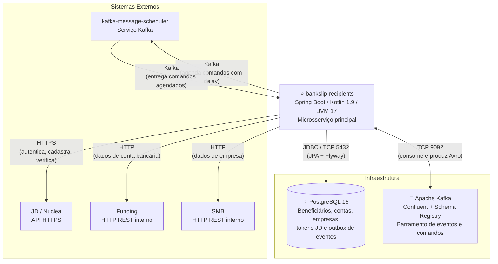

### 2.3 Componentes (Nível 3)

Os diagramas a seguir mostram os componentes agrupados por funcionalidade. Cada diagrama exibe apenas os componentes relevantes para aquele contexto.

#### 2.3.1 Cadastro de Beneficiário

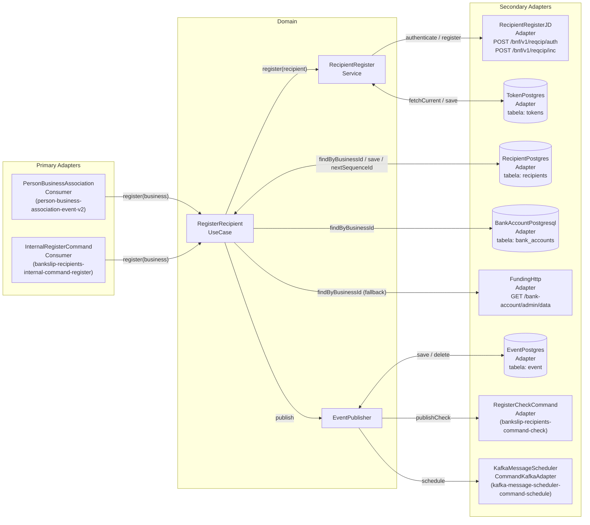

#### 2.3.2 Verificação de Cadastro (Check)

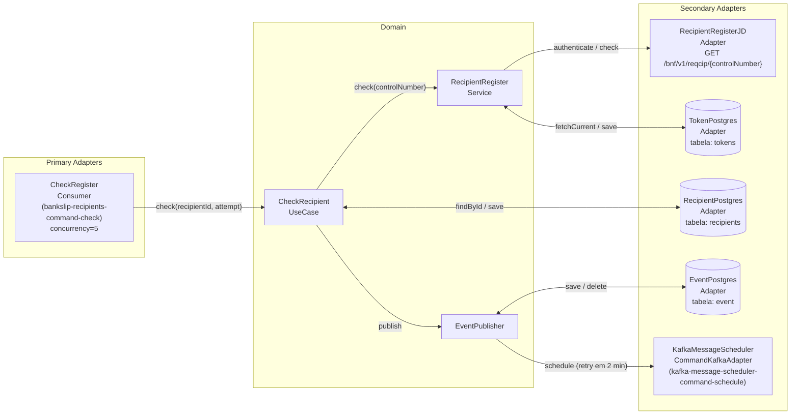

#### 2.3.3 Backoffice (Operações Manuais)

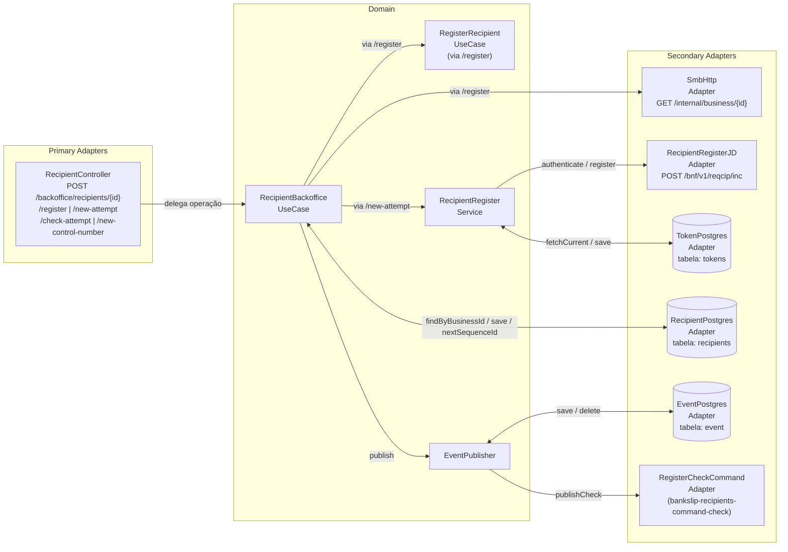

#### 2.3.4 Cache de Dados (Conta Bancária e Empresa)

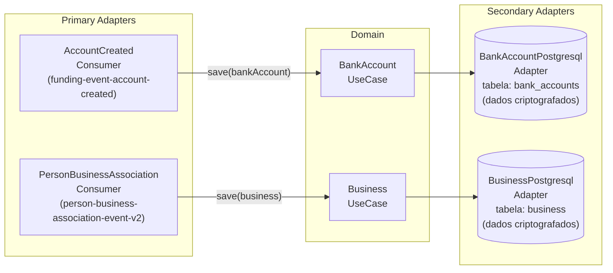

#### 2.3.5 Outbox Retry (Scheduler)

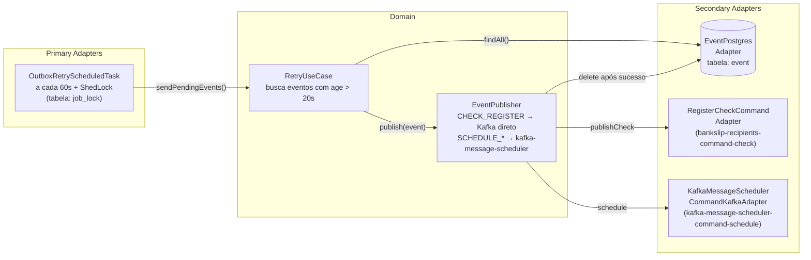

---

## 3. Fluxos Principais

### 3.1 Cadastro de Beneficiário (Fluxo Principal)

**Trigger**: Evento Kafka `person-business-association-event-v2` com `eventType=CREATE` e `business.status=ACTIVE`.

**Passos**:
1. Consumer filtra apenas eventos de criação de empresa ativa
2. Verifica idempotência (se já existe `Recipient` para o `businessId`, ignora)
3. Verifica janela de operação Nuclea (05:40–06:05 BRT) — se fechada, agenda para 06:06
4. Busca conta bancária (cache local → fallback HTTP Funding)
5. Gera `sequenceId` (sequence SQL) e `ControlNumber`
6. Autentica com JD (cache de token → novo token se expirado)
7. Chama API JD para registrar (com retry exponencial para 5xx)
8. Persiste `Recipient` com status `REQUESTED` + salva `CheckCommand` no outbox

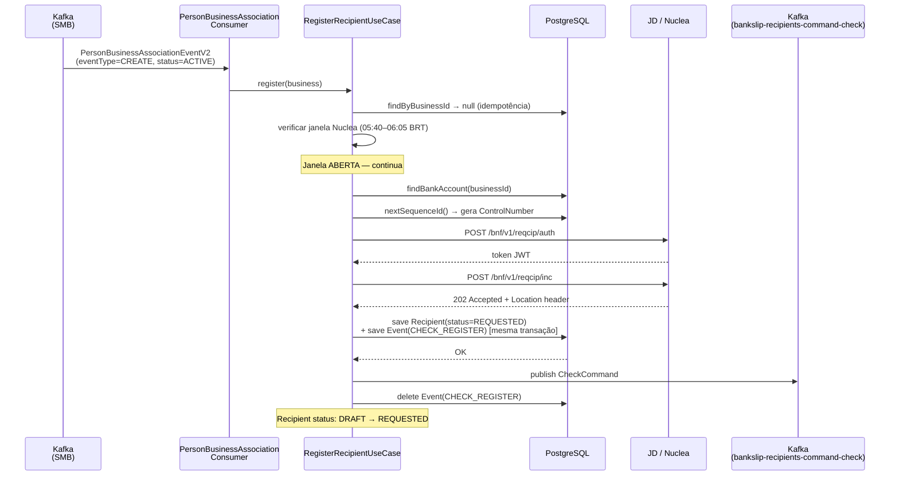

**Pontos de falha**:
- JD retorna 4xx → Recipient salvo com status `ERROR` e `errorRegister` preenchido
- JD indisponível (5xx esgota retries) → `ScheduleRegisterCommand` agendado para 30 min, **nenhum registro salvo**
- Janela Nuclea fechada → `ScheduleRegisterCommand` agendado para 06:06 BRT, **nenhum registro salvo**

---

### 3.2 Verificação de Cadastro (Check)

**Trigger**: Evento Kafka `bankslip-recipients-command-check` (auto-produzido após registro bem-sucedido).

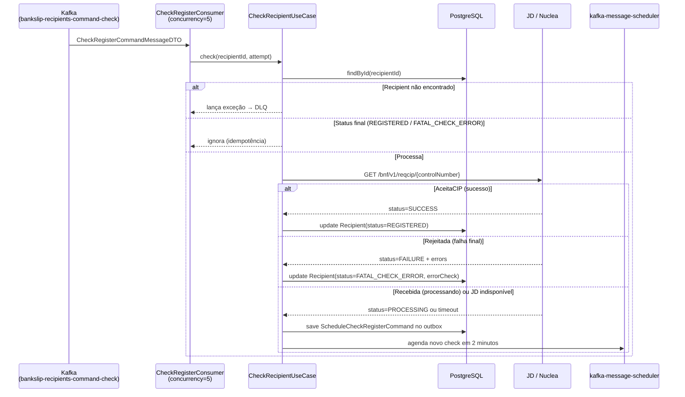

**Pontos de falha**:
- Erros retryáveis da Nuclea (`EDDA0160`, `EDDA0172`) → agendamento de nova tentativa
- `EDDA0228` (já cadastrado) → tratado como sucesso implícito
- Sem limite máximo de tentativas de check — pode loop indefinidamente em `PROCESSING`

---

### 3.3 Retry por Janela Nuclea ou Indisponibilidade JD

**Trigger**: Evento Kafka `bankslip-recipients-internal-command-register` (entregue pelo kafka-message-scheduler após delay).

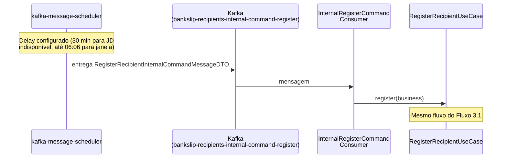

---

### 3.4 Outbox Retry (Scheduler Local)

**Trigger**: Cron a cada 60 segundos, com lock distribuído via ShedLock (tabela `job_lock`).

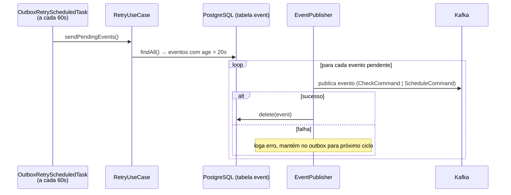

**Propósito**: Garante entrega **at-least-once** para eventos que não foram publicados com sucesso na primeira tentativa (ex: Kafka indisponível no momento da transação).

---

### 3.5 Backoffice — Operações Manuais

**Trigger**: Requisições REST para `/backoffice/recipients/{businessId}`.

| Endpoint | Ação | Pré-condição |
|---|---|---|
| `POST /register` | Busca empresa no SMB e aciona `RegisterRecipientUseCase` | Qualquer estado |
| `POST /new-attempt` | Resubmete para JD e incrementa `registerAttempt` | Status: `ERROR`, `DRAFT`, `FATAL_CHECK_ERROR`, `FATAL_REGISTER_ERROR` |
| `POST /check-attempt` | Publica comando de check | Qualquer estado |
| `POST /new-control-number` | Gera novo `sequenceId` e `ControlNumber` | Status permite re-registro |

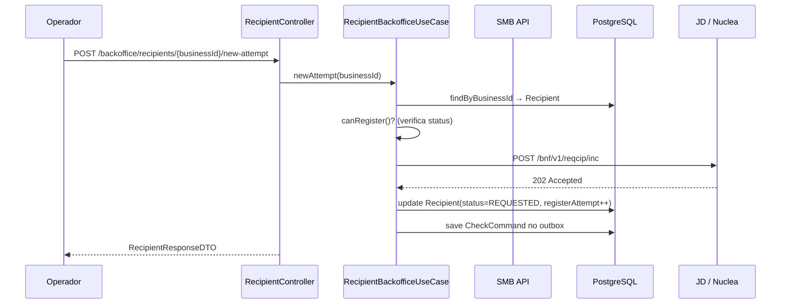

---

### 3.6 Cache de Conta Bancária (Fluxo Auxiliar)

**Trigger**: Evento Kafka `funding-event-account-created`.

**Propósito**: O evento chega via Kafka com o formato `BankAccountCreatedDTO` (Avro). O serviço persiste os dados localmente para que o fluxo de registro não precise chamar a API do Funding a cada vez. O formato do evento usa um `AvroDeserializer` customizado que aceita tanto o formato Confluent (com 5 bytes mágicos) quanto Avro binário puro.

---

## 4. Integrações Externas

### 4.1 JD / Nuclea

**Base URL**: `jd.recipient.baseUrl` (env: `JD_RECIPIENT_BASE_URL`)

| Endpoint | Método | Propósito | Autenticação |
|---|---|---|---|
| `/bnf/v1/reqcip/auth` | POST | Obter token JWT | `CodigoLegado` + `Senha` no body |
| `/bnf/v1/reqcip/inc` | POST | Cadastrar beneficiário | Bearer token no header |
| `/bnf/v1/reqcip/{controlNumber}` | GET | Verificar status do cadastro | Bearer token no header |

**Formato de registro** (campos relevantes do `RegisterRequestDTO`):
- `ISPBPartDestinatarioAdmtd`: `37880206` (ISPB fixo da Cora)
- `TpPessoaBenfcrio`: `"J"` (Jurídica — apenas CNPJs)
- `DtIniRelctPart`: calculado com ajuste para a janela Nuclea (após 05:51 BRT)
- `NumCtrlPart`: `ControlNumber` no formato `BNFLC{yyMMdd}{seq9d}`

**Respostas de check** (`NucleaStatusFinal`):

| Status Nuclea | Código campo `status` | Ação do serviço |
|---|---|---|
| `AceitaCIP` | SUCCESS | Marca como `REGISTERED` |
| `Rejeitada` | FAILURE | Marca como `FATAL_CHECK_ERROR` |
| `Recebida` | PROCESSING | Agenda novo check em 2 min |
| `400` | NOT_FOUND | Agenda novo check |

**Erros retryáveis**: `EDDA0160`, `EDDA0172`  
**Já cadastrado**: `EDDA0228` (ignorado como se fosse sucesso)

**Impacto em caso de falha**: O fluxo de registro é interrompido e um comando agendado é enviado para reprocessamento em ~30 minutos. O token JD é cacheado no banco de dados (tabela `tokens`, unlogged) para evitar re-autenticação desnecessária.

---

### 4.2 Funding

**Base URL**: `cora.funding.baseUrl` (env: `FUNDING_BASE_URL`, default: `http://funding.cora`)

| Endpoint | Método | Propósito |
|---|---|---|
| `/bank-account/admin/data?businessId={id}` | GET | Buscar agência e número de conta |

**Headers**: `Cache-Control: no-cache`, `x-scopes-admin: true`

**Impacto em caso de falha**: Usado apenas como fallback quando o cache local (tabela `bank_accounts`) não contém o dado. Se falhar, o cadastro do beneficiário falha.

---

### 4.3 SMB (Small & Medium Business)

**Base URL**: `cora.smb.baseUrl` (env: `SMB_BASE_URL`, default: `http://smb.cora`)

| Endpoint | Método | Propósito |
|---|---|---|
| `/internal/business/{businessId}` | GET | Buscar dados de empresa (razão social, CNPJ, nome fantasia) |

**Usado exclusivamente no fluxo backoffice** (`POST /register`). O fluxo principal obtém dados da empresa pelo próprio evento Kafka do SMB.

---

### 4.4 kafka-message-scheduler

**Protocolo**: Kafka  
**Tópico de comando**: `kafka-message-scheduler-command-schedule`

**Comandos enviados**:

| Situação | Tópico alvo | Payload | Delay |
|---|---|---|---|
| JD indisponível (5xx esgotados) | `bankslip-recipients-internal-command-register` | `RegisterRecipientInternalCommandMessageDTO` | ~30 min |
| Janela Nuclea fechada | `bankslip-recipients-internal-command-register` | `RegisterRecipientInternalCommandMessageDTO` | até 06:06 BRT |
| Status Recebida no check | `bankslip-recipients-command-check` | `CheckRegisterCommandMessageDTO` | 2 min |
| JD indisponível no check | `bankslip-recipients-command-check` | `CheckRegisterCommandMessageDTO` | 2 min |

---

### 4.5 Eventos Kafka Consumidos e Produzidos

| Tópico | Direção | Formato | Propósito |
|---|---|---|---|
| `person-business-association-event-v2` | Consumido | Avro (Schema Registry) | Empresa ativa → inicia cadastro |
| `funding-event-account-created` | Consumido | Avro (raw binary / Confluent) | Cacheia conta bancária |
| `bankslip-recipients-internal-command-register` | Consumido + Produzido* | Avro | Comandos de registro (direto ou via scheduler) |
| `bankslip-recipients-command-check` | Consumido + Produzido | Avro | Comandos de verificação |
| `kafka-message-scheduler-command-schedule` | Produzido | Avro | Agendamento de mensagens com delay |
| `topic-dlq` | Produzido | Bytes + metadados | Dead Letter Queue para falhas não-recuperáveis |

*Produzido indiretamente via kafka-message-scheduler.

---

## 5. Dados e Persistência

### Banco de Dados

**PostgreSQL 15** com pool Hikari:
- `maximumPoolSize`: 30  
- `minimumIdle`: 5  
- `connectionTimeout`: 20s  
- `idleTimeout`: 20s  
- `maxLifetime`: 60s  

Migrações gerenciadas pelo **Flyway** (13 versões, V001–V013).

---

### Entidades Principais

#### `recipients`

| Coluna | Tipo | Observação |
|---|---|---|
| `id` | UUID PK | |
| `business_id` | UUID | Único por empresa |
| `sequence_id` | BIGINT | Gerado por `recipients_sequence_id` (sequence SQL) |
| `trade_name` | TEXT | Criptografado (AES) |
| `fantasy_name` | TEXT | Criptografado (AES), nullable |
| `cnpj` | TEXT | Criptografado (AES) |
| `control_number` | VARCHAR | `BNFLC{yyMMdd}{seq9d}`, indexed |
| `status` | VARCHAR | `DRAFT`, `REQUESTED`, `REGISTERED`, `ERROR`, `FATAL_REGISTER_ERROR`, `FATAL_CHECK_ERROR` |
| `request_id` | VARCHAR | ID retornado pelo JD após registro |
| `location` | VARCHAR | URL de localização retornada pelo JD |
| `error_check` | TEXT | Detalhes do erro na verificação |
| `error_register` | TEXT | Detalhes do erro no registro |
| `register_attempt` | INT | Contador de tentativas de registro |
| `bank_account_id` | UUID FK | `bank_accounts.id` |
| `created_at` | TIMESTAMP | |

#### `bank_accounts`

Cache de contas bancárias consumidas do Funding.

| Coluna | Tipo | Observação |
|---|---|---|
| `id` | UUID PK | |
| `business_id` | UUID | |
| `branch` | TEXT | Criptografado |
| `number` | TEXT | Criptografado |
| `digit` | TEXT | Criptografado |

#### `business`

Cache de empresas consumidas do SMB.

| Coluna | Tipo | Observação |
|---|---|---|
| `id` | UUID PK | |
| `cnpj` | TEXT | Criptografado |
| `trade_name` | TEXT | Criptografado |
| `fantasy_name` | TEXT | Criptografado, nullable |

#### `tokens`

Cache do token JWT de autenticação com JD. Tabela **UNLOGGED** (alta performance, sem WAL, dados descartados em crash).

| Coluna | Tipo | Observação |
|---|---|---|
| `id` | UUID PK | |
| `token` | TEXT | Criptografado |
| `expires_at` | TIMESTAMP | Usado para invalidação |

#### `event` (Outbox)

Implementa o padrão **Transactional Outbox** para garantia de entrega de eventos Kafka.

| Coluna | Tipo | Observação |
|---|---|---|
| `id` | UUID PK | |
| `name` | VARCHAR | `CHECK_REGISTER`, `SCHEDULE_REGISTER`, `SCHEDULE_CHECK_REGISTER` |
| `payload` | TEXT | JSON serializado do comando |
| `type` | VARCHAR | Fully-qualified class name para deserialização |
| `created_at` | TIMESTAMP | Usado pelo retry (age > 20s) |

#### `job_lock`

Tabela de locking distribuído do **ShedLock** para o scheduler outbox.

---

### Máquina de Estados do Recipient

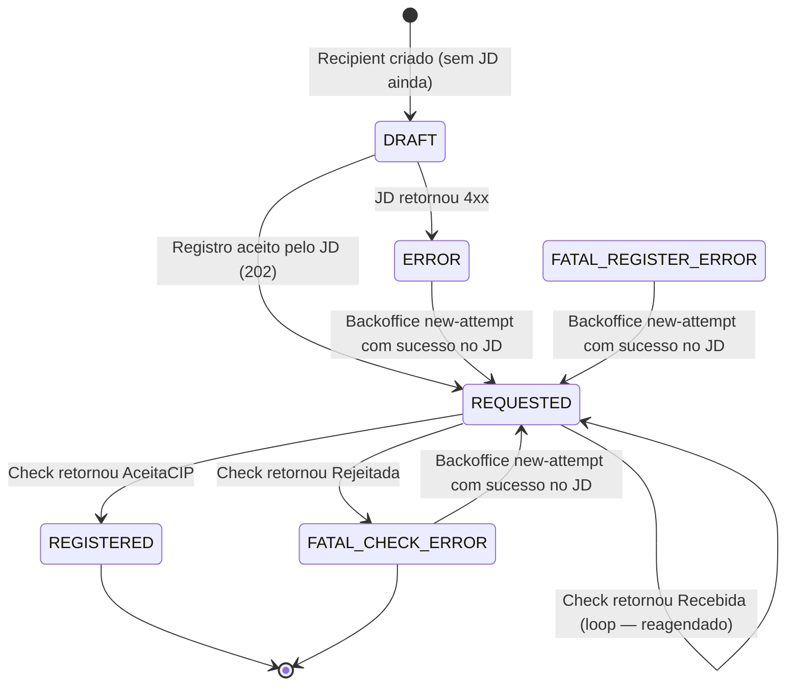

**Status finais** (sem transição automática): `REGISTERED`, `FATAL_CHECK_ERROR`  
**Status intermediários**: `DRAFT`, `REQUESTED`, `ERROR`, `FATAL_REGISTER_ERROR`

---

### Criptografia de Dados

Os campos PII (Personally Identifiable Information) — `trade_name`, `fantasy_name`, `cnpj` nas tabelas `recipients`, `bank_accounts` e `business` — são **criptografados em repouso** usando a lib interna `cora-crypto-lib` (AES). A criptografia/descriptografia ocorre nos adapters de persistência antes de escrever/ler do banco.

---

## 6. Considerações de Resiliência

### 6.1 Retry HTTP com Backoff Exponencial

Implementado via `RetryInterceptor` no `OkHttpClient` (arquivo: `secondary/client-rest/.../config/OkHttpClientConfig.kt`).

| Parâmetro | Valor (produção) | Valor (teste) |
|---|---|---|
| `maxRetries` | 3 | 3 |
| `baseDelayMs` | 1000 ms | 100 ms |
| `maxDelayMs` | 8000 ms | 8000 ms |

**Sequência de tentativas**: original → +1s → +2s → +4s (total: 4 tentativas)

- ✅ Retenta em: HTTP 5xx, `IOException`, erros de conexão
- ❌ Não retenta em: HTTP 4xx, 2xx
- Após esgotar retries: lança `JDUnavailableException` (exceção de domínio)

**Mecanismo de delay**: `LockSupport.parkNanos()` — bloqueia a thread atual.

---

### 6.2 Timeouts do OkHttpClient

| Timeout | Valor |
|---|---|
| `connectTimeout` | 15 segundos |
| `readTimeout` | 30 segundos |
| `writeTimeout` | 15 segundos |
| `callTimeout` | 45 segundos (total da operação) |

---

### 6.3 Padrão Outbox (Transactional Outbox Pattern)

O evento Kafka é salvo na tabela `event` **dentro da mesma transação** do registro do `Recipient`. Isso garante que, mesmo se o Kafka estiver indisponível no momento do commit, o evento não seja perdido. O `OutboxRetryScheduledTask` (com lock distribuído ShedLock) republica eventos pendentes a cada 60 segundos.

**Semântica**: at-least-once delivery. O `KafkaMessageSchedulerCommandKafkaAdapter` usa um `idempotencyId` baseado em `{recipientId}{attempt}` para evitar duplicatas no scheduler.

---

### 6.4 Dead Letter Queue (DLQ)

Consumidores Kafka com `DefaultErrorHandler`: 3 tentativas com `FixedBackOff` de 500ms. Após esgotar, a mensagem é publicada no tópico `topic-dlq` com metadados (tópico origem, partition, offset, consumer group, stack trace, payload).

---

### 6.5 Idempotência

| Mecanismo | Cobertura |
|---|---|
| Check de `findByBusinessId` antes do registro | Evita criar dois `Recipients` para a mesma empresa |
| Check de status final antes do check JD | Evita re-processar `REGISTERED` ou `FATAL_CHECK_ERROR` |
| `idempotencyId` no scheduler (`{recipientId}{attempt}`) | Evita agendar o mesmo check duplicado |
| Kafka producer com `enable.idempotence=true` | Evita duplicatas em reenvios do producer |
| `canRegister()` no domínio | Bloqueia tentativas sobre status inválidos |

---

### 6.6 Lock Distribuído

O `OutboxRetryScheduledTask` usa **ShedLock** com lock na tabela `job_lock`. Configuração:
- `lockAtMostFor`: 30 minutos (garante liberação mesmo em crash)
- `lockAtLeastFor`: 1 minuto (evita re-execução imediata)

---

## 7. Análise Crítica

### 7.1 Problemas e Riscos Identificados

#### 🔴 Trust-All SSL no OkHttpClient

**Localização**: `secondary/client-rest/.../config/OkHttpClientConfig.kt`

O cliente HTTP desabilita a verificação de certificados SSL (`TrustManager` que aceita qualquer certificado, `HostnameVerifier` que aceita qualquer hostname). Isso expõe o serviço a ataques man-in-the-middle nas comunicações com JD/Nuclea, Funding e SMB.

**Recomendação**: Configurar o truststore com o certificado da CA raiz do parceiro JD, ou ao menos restringir a verificação relaxada apenas para o cliente JD.

---

#### 🔴 `LockSupport.parkNanos()` Bloqueia Thread do Consumer Kafka

**Localização**: `RetryInterceptor` em `OkHttpClientConfig.kt`

O backoff exponencial usa `LockSupport.parkNanos()`, que bloqueia a thread por até 1s + 2s + 4s = 7 segundos durante retries. Como os consumers Kafka são threads síncronas, isso reduz drasticamente o throughput: um consumer com concorrência=5 pode ter todas as threads bloqueadas simultaneamente aguardando retries do JD.

**Risco maior**: O `CheckRegisterConsumer` tem `max.poll.interval.ms=90000` (90s). Se 3 retries consumirem ~7s + overhead, está dentro do limite, mas é um gargalo significativo durante picos de indisponibilidade do JD.

**Recomendação**: Separar o retry HTTP de I/O da thread do consumer (ex: via coroutines com delay não-bloqueante, ou Resilience4j com agendamento assíncrono).

---

#### 🟡 `PROPAGATION_NESTED` pode causar comportamento inesperado

**Localização**: `TransactionManagerAdapter` em `secondary/postgres`

`PROPAGATION_NESTED` usa savepoints em vez de criar uma nova transação. Se o banco não suportar savepoints corretamente ou se a transação pai já estiver com flags de rollback, pode haver comportamento diferente do esperado. Em alguns cenários, uma falha na subtransação pode silenciosamente não fazer rollback da transação externa.

**Recomendação**: Validar se `PROPAGATION_REQUIRES_NEW` seria mais adequado, ou documentar explicitamente por que `NESTED` é necessário.

---

#### 🟡 Feature Flags com Cache In-Memory (Não Distribuído)

**Localização**: `FeatureFlagManager` em `domain/shared/featureflag`

O cache de feature flags tem TTL de 60 segundos e é armazenado em `ConcurrentHashMap` local. Em um ambiente com múltiplas réplicas do serviço, instâncias diferentes podem ter valores de feature flag distintos por até 60 segundos após uma mudança.

**Impacto**: Comportamento inconsistente entre réplicas (ex: uma instância processa, outra rejeita).

**Recomendação**: Para flags críticos, considerar TTL menor ou uso de cache distribuído (Redis).

---

#### 🟡 Ausência de Circuit Breaker Formal

O serviço implementa retry com backoff, mas não possui circuit breaker. Em cenários de indisponibilidade prolongada do JD, cada mensagem Kafka ainda tentará 4 chamadas HTTP antes de desistir, potencialmente acumulando consumers bloqueados e lag no tópico.

**Recomendação**: Adicionar Resilience4j com `CircuitBreaker` no `RecipientRegisterJDAdapter`. O circuit breaker abriria após N falhas consecutivas, rejeitando imediatamente novas tentativas e evitando cascata de threads bloqueadas.

---

#### 🟡 Loop Potencialmente Infinito no Check

O status `Recebida (PROCESSING)` da Nuclea gera um novo agendamento de check indefinidamente, sem limite de tentativas. A constante `MAX_ATTEMPTS = 20` existe no domínio, mas não é verificada no fluxo de check — é verificada apenas no `canRegister()` para re-registro.

**Risco**: Um recipient pode ficar em loop de check infinito se a Nuclea nunca resolver o status.

**Recomendação**: Adicionar limite de tentativas de check (ex: após 20 tentativas, mover para `FATAL_CHECK_ERROR`).

---

#### 🟢 Ponto de Atenção: Tabela `tokens` é UNLOGGED

A tabela `tokens` (cache do token JD) é uma tabela UNLOGGED no PostgreSQL, o que significa que em caso de crash do banco, os dados são perdidos. Isso é aceitável pois o sistema simplesmente solicitará um novo token, mas deve ser documentado.

---

### 7.2 Oportunidades de Simplificação

| Área | Observação |
|---|---|
| **Ausência de schema do outbox** | O campo `type` do outbox armazena o FQCN da classe, criando acoplamento entre a tabela e o código. Uma migração de nome de classe quebraria a deserialização de eventos pendentes. Considerar usar o `name` enum para deserialização. |
| **Dois caminhos para `bank_account`** | O fluxo de registro busca conta no cache local ou via HTTP. Se o evento `funding-event-account-created` sempre chegar antes do `person-business-association-event-v2`, o fallback HTTP raramente seria necessário. Monitorar e eventualmente simplificar. |
| **`inbox` table não utilizada** | A migração V001 cria uma tabela `inbox` para deduplicação de mensagens, mas não há código que a utilize. Parece ser um resquício de uma versão anterior. |
| **Group ID verbose** | `bankslip-recipients-bankslip-recipients-internal-command-register` (com prefixo duplicado) — provável erro de configuração. |

---

### 7.3 Pontos de Acoplamento Excessivo

| Ponto | Descrição |
|---|---|
| **Evento SMB** | O `PersonBusinessAssociationConsumer` concentra dois fluxos distintos: salvar empresa E iniciar registro. Uma falha em qualquer um deles compromete ambos dentro da mesma mensagem. |
| **ISPB fixo no código** | O ISPB da Cora (`37880206`) está hardcoded no `JdHttpClient`. Deve ser externalizado para configuração. |
| **Formato de `ControlNumber` acoplado à data** | O `ControlNumber` embute a data de geração (`yyMMdd`). Se for necessário reprocessar um recipient com um `ControlNumber` antigo, a data no número ficará inconsistente. |
