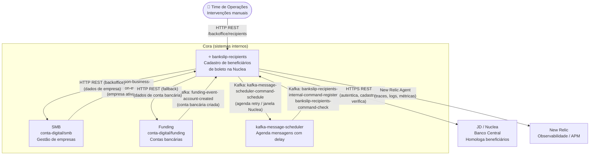
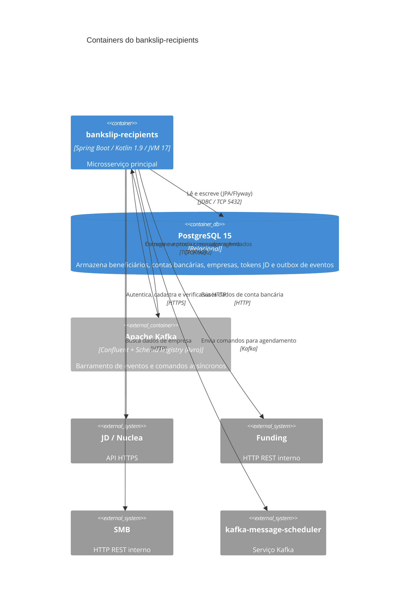

# Cursos

> ## Menu
>
> - [Docker](Docker.md)
> - [Git](Git.md)
> - [Integração Continua](integracao-continua.md)
> - [Comunicação entre sistemas](comunicacao-entre-sistemas.md)

---

```mermaid
flowchart TB
    ops(["👤 Time de Operações\nIntervenções manuais"])

    subgraph cora ["Cora (sistemas internos)"]
        smb["SMB\nconta-digital/smb\nGestão de empresas"]
        funding["Funding\nconta-digital/funding\nContas bancárias"]
        scheduler["kafka-message-scheduler\nAgenda mensagens com delay"]
        bsr["⭐ bankslip-recipients\nCadastro de beneficiários\nde boleto na Nuclea"]
    end

    jd["JD / Nuclea\nBanco Central\nHomologa beneficiários"]
    newrelic["New Relic\nObservabilidade / APM"]

    smb -->|"Kafka: person-business-association-event-v2\n(empresa ativa criada)"| bsr
    funding -->|"Kafka: funding-event-account-created\n(conta bancária criada)"| bsr
    bsr -->|"HTTPS REST\n(autentica, cadastra, verifica)"| jd
    bsr -->|"HTTP REST (fallback)\n(dados de conta bancária)"| funding
    bsr -->|"HTTP REST (backoffice)\n(dados de empresa)"| smb
    bsr -->|"Kafka: kafka-message-scheduler-command-schedule\n(agenda retry / janela Nuclea)"| scheduler
    scheduler -->|"Kafka: bankslip-recipients-internal-command-register\nbankslip-recipients-command-check"| bsr
    ops -->|"HTTP REST\n/backoffice/recipients"| bsr
    bsr -->|"New Relic Agent\n(traces, logs, métricas)"| newrelic
```

```mermaid
C4Container
    title Containers do bankslip-recipients

    Container(app, "bankslip-recipients", "Spring Boot / Kotlin 1.9 / JVM 17", "Microsserviço principal")
    ContainerDb(pg, "PostgreSQL 15", "Relacional", "Armazena beneficiários, contas bancárias, empresas, tokens JD e outbox de eventos")
    Container_Ext(kafka, "Apache Kafka", "Confluent + Schema Registry (Avro)", "Barramento de eventos e comandos assíncronos")

    System_Ext(jd, "JD / Nuclea", "API HTTPS")
    System_Ext(funding, "Funding", "HTTP REST interno")
    System_Ext(smb, "SMB", "HTTP REST interno")
    System_Ext(scheduler_svc, "kafka-message-scheduler", "Serviço Kafka")

    Rel(app, pg, "Lê e escreve (JPA/Flyway)", "JDBC / TCP 5432")
    Rel(app, kafka, "Consome e produz mensagens Avro", "TCP 9092")
    Rel(app, jd, "Autentica, cadastra e verifica via HTTP", "HTTPS")
    Rel(app, funding, "Busca dados de conta bancária", "HTTP")
    Rel(app, smb, "Busca dados de empresa", "HTTP")
    Rel(kafka, app, "Entrega eventos e comandos agendados", "TCP 9092")
    Rel(app, scheduler_svc, "Envia comandos para agendamento", "Kafka")
```
