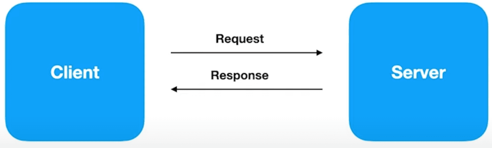
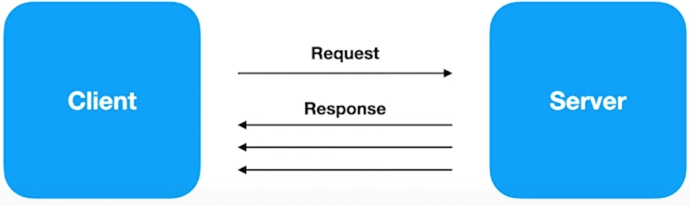
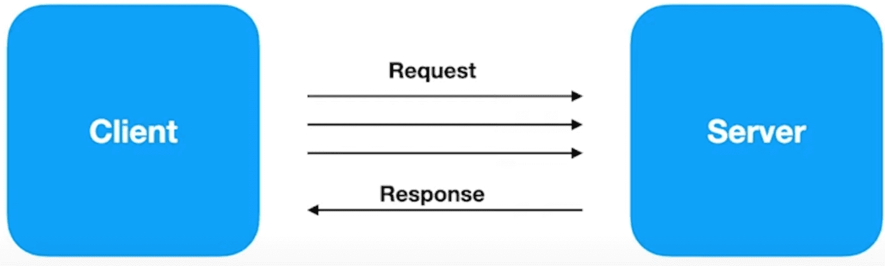
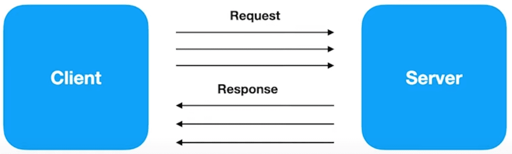

# Comunicação entre sistemas

> ## Menu
>
>
> - [Home](README.md)
> - [Rest](#rest)
> - [GraphQL](#graphql)
---

### Introdução

Quando estamos trabalhando com comunicação entre sistemas temos dois tipo de comunicação.
* <b>Síncrona</b> - Comunicação em tempo real, exemplo eu ligo para a pessoa e ela me responde
  * REST, GRPC, GraphQL são exemplos de comunicação síncrona
  
* <b>Assíncrona</b> - Você inicia a comunicação e quando a pessoa ou sistema puder ele vai te responder, exemplo você 
envia uma mensagem pelo telegram e aguarda a pessoa te responder
  * Para comunicação assíncrona geralmente usamos os brokers de mensagens (Kafka,RabitMQ, SQS, ActiveMQ)

---

### Rest
**REST** (*Representational State Transfer*) é um estilo arquitetural para construção de APIs, que se baseia em um conjunto de princípios simples para a comunicação entre sistemas na web. Ele foi introduzido por Roy Fielding em sua tese de doutorado em 2000.

#### Princípios Fundamentais do REST

1. **Recursos Identificáveis**:
  - Cada elemento de informação (recurso) é identificado por uma URL única. Por exemplo, `/usuarios/123` pode representar um recurso de usuário específico.

2. **Métodos HTTP**:
  - O REST usa os verbos HTTP de forma semântica para operar sobre os recursos:

    - `GET`: Recuperar dados de um recurso.
    - `POST`: Criar um novo recurso.
    - `PUT`: Atualizar um recurso existente.
    - `DELETE`: Remover um recurso.

3. **Representações de Recursos**:
  - A interação com recursos é feita através de suas representações (JSON, XML, etc.), que são retornadas nas respostas das requisições.

4. **Stateless (Sem Estado)**:
  - Cada requisição feita ao servidor deve conter todas as informações necessárias para ser compreendida. O servidor não armazena o estado do cliente entre as requisições.

5. **Cacheável**:
  - Respostas de APIs RESTful podem ser cacheadas para melhorar o desempenho, desde que o cliente possa identificar quando uma resposta é reutilizável.

6. **Camadas**:
  - A arquitetura REST pode ser organizada em camadas, permitindo que a API seja escalável e capaz de utilizar balanceadores de carga, proxies, entre outros.

#### Vantagens do REST
- Simplicidade no uso e na construção.
- Independência entre cliente e servidor.
- Escalabilidade e facilidade de evolução.
- Amplamente adotado e compatível com tecnologias web.

> Em resumo, REST define como os componentes de uma API devem interagir na web, utilizando recursos identificáveis, métodos HTTP e mantendo a comunicação *stateless*.


#### Níveis de Maturidade REST - *Richardson Maturity Model*

#### Nível 0 - *The Swamp of POX* (Plain Old XML)
- **Definição**: Serviço é apenas uma interface de protocolo único (geralmente HTTP), mas funciona de forma genérica, sem seguir os princípios REST.
- **Característica**: Troca de informações via um único endpoint com métodos como `POST` ou `GET`, sem diferenciação por recurso.
- **Exemplo**: Web services SOAP, onde o serviço responde de maneira uniforme a todas as requisições, independentemente da intenção.

#### Nível 1 - *Recursos* (Resources)
- **Definição**: Endpoints são organizados por recursos distintos, com URLs que representam esses recursos.
- **Característica**: Cada recurso tem uma URL específica, mas os métodos HTTP ainda não são utilizados de forma adequada.
- **Exemplo**: URLs como `/produtos`, `/clientes`, porém utilizando apenas o método `POST` para todas as operações.

#### Nível 2 - *Verbos HTTP* (HTTP Verbs)
- **Definição**: Utilização correta dos verbos HTTP (`GET`, `POST`, `PUT`, `DELETE`, etc.) para cada operação, de acordo com a semântica REST.
- **Característica**: Cada operação (criação, leitura, atualização e exclusão) está associada ao verbo HTTP adequado.
- **Exemplo**: `GET /clientes`, `POST /clientes`, `PUT /clientes/{id}`, `DELETE /clientes/{id}`.

#### Nível 3 - *HATEOAS* (Hypermedia as the Engine of Application State)
- **Definição**: APIs orientadas a hipermídia, onde as respostas contêm links que permitem a navegação através dos recursos.
- **Característica**: A API não só devolve dados, mas também informações sobre possíveis ações e recursos relacionados, melhorando a descoberta.
- **Exemplo**: Resposta de uma API para `GET /clientes/{id}` pode incluir links para outros endpoints, como `"rel": "/clientes/{id}/pedidos"`.


#### Resumo da Evolução dos Níveis

1. **Nível 0**: Apenas um endpoint genérico, sem distinção por recurso.
2. **Nível 1**: URLs organizadas por recurso, mas sem uso adequado de verbos HTTP.
3. **Nível 2**: Uso correto de verbos HTTP para operações com recursos.
4. **Nível 3**: Respostas com hipermídia (HATEOAS), fornecendo links de navegação para os recursos relacionados.

---    

### GraphQL
GraphQL é uma linguagem de consulta de dados desenvolvida pelo Facebook em 2012 e aberta ao público em 2015. Ele 
permite que os clientes (como aplicativos web ou mobile) consultem APIs de forma mais flexível e eficiente do que 
com REST tradicional. Em vez de múltiplos endpoints para diferentes operações, o GraphQL usa um único endpoint, onde 
o cliente especifica exatamente os dados que deseja, economizando recursos e evitando o recebimento de informações 
desnecessárias.

Principais características:

* <b>Consulta precisa:</b> O cliente pode pedir exatamente os campos de dados que precisa, evitando sobrecarga de 
informações.
* <b>Tipagem forte:</b> Define um esquema rígido para as consultas e respostas, garantindo consistência nos dados.
* <b>Agilidade nas respostas:</b> Possibilita obter dados relacionados em uma única chamada, diferentemente de REST, 
onde você pode precisar de múltiplas requisições.
* <b>Resolve over-fetching e under-fetching:</b> Permite a consulta exata de informações, evitando o problema de 
receber dados demais ou de menos.

Em resumo, o GraphQL melhora a eficiência das APIs, otimizando o tráfego de dados e tornando as interações 
cliente-servidor mais flexíveis e dinâmicas.

---    

### GRPC
É um framework desenvolvido pela Google que tem o objetivo de facilitar o processo de comunicação entre sistemas de 
uma forma extremamente rápida, leve, independente de linguagem, ele faz parte da CNCF(Cloud Native Computing Foundation)

#### Onde podemos utilizar
* ideal para microserviços
* Mobile, Browsers e Backend
* Geração das bibliotecas de forma automática
* Streaming bidirecional utilizando HTTP/2

#### Liguagens (Suporte oficial)
* gRPC-GO
* gRPC-JAVA
* gRPC-C
  * C++
  * Python
  * Ruby
  * Objective C
  * PHP
  * C#
  * Node.js
  * Dart

#### RPC (Remote Procedure Call)
Chamada Remota em um serviço que está em um servidor

#### Protocol Buffers
Protocolo utilizado para trafegar dados em formato binário, necessário a serialização e desserialização,
[mais detalhes aqui](https://protobuf.dev/)

***Protocol Buffers VS Json***
* arquivos binários < JSON
* Processo de serializaçãoé mais leve(CPU) do que JSON
* Gasta menos recurso de rede
* Processo é mais veloz

```protobuf
  syntax = "proto3";
    
  message SearchRequest {
    string query = 1;
    int32 page_number = 2;
    int32 result_per_page = 3;
  }
  
```

#### HTTP/2
* Nome original criado pela Google era SPDY
* Lançado em 2015
* Dados trafegados são binários e não texto como no HTTP 1.1
* Utiliza a mesma conexão TCP para enviar e receber dados do cliente e do servidor (Multiplex)
* Server Push
* Headers são comprimidos
* Gasta menos recursos de rede
* Processo é mais veloz


#### Formatos de comunicação 

##### gRPC - API "unary"


##### gRPC - API "Server streaming"


##### gRPC - API "Client streaming" 


##### gRPC - API "Bi directional streaming" 



#### REST vs gRPC
| REST                                | gRPC                       |
|-------------------------------------|----------------------------|
| Texto / JSON                        | Protocol Buffers           |
| Unidirecional                       | Bidirecional e Assíncrono  |
| Alta latência                       | Baixa latência             |
| Sem contrato(maior chance de erros) | Contrato definido (.proto) |
| Sem suporte a streaming (Req/Resp)  | Suporte a streaming        |
| Design pré-definido                 | Design é livre             |
| Biblioteca de terceiro              | Geração de código          |

