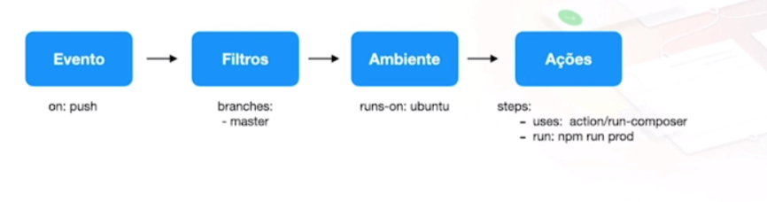
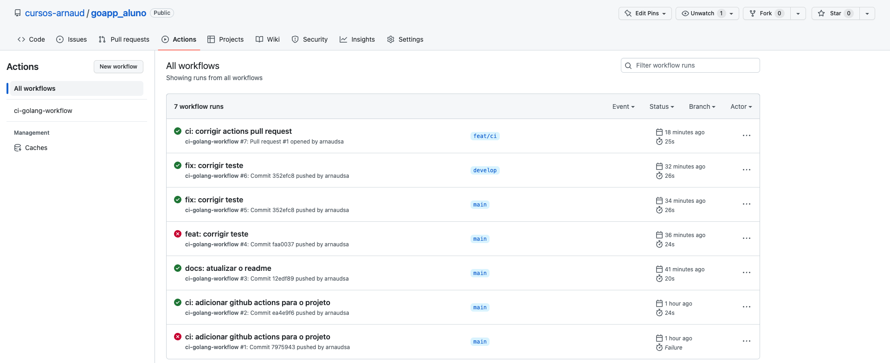
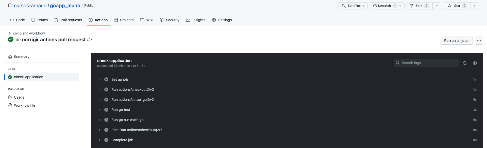

# Curso de Integração contínua ou CI - Continuous Integration

> ## Menu
>
>
> - [Home](README.md)
> - [Introdução](#introdução)

---

### Introdução

#### **O que é**

É o processo de integrar modificações do codebase de forma contínua e automatizada, evitando assim erros humanos de verificação, garantindo mais agilidade e segurança no processo de desenvolvimento de um software.

#### **Principais processos**

- Execução de testes
- Linter
- Verificações de qualidade de código
- Verificações de segurança
- Geração de artefatos prontos para o processo de deploy
- Identificação da próxima versão a ser gerada no software
- Geração de tags e releases

#### **Ferramentas populares**

- Jenkins
- Github Actions
- Circle CI
- AWS Code Build
- Azure DevOps
- Google Cloud Build
- Gitlab Pipelines / CI

#### **Para o nosso estudo vamos utilizar o github actions**

O github actions e baseado em um ou mais workflows.

> #### **Wokflows**
>
> - São conjuntos de processos definidos por você. Ex: Fazer o build + rodar os testes da aplicação
> - É possível ter mais do que um workflow por repositório
> - Definidos em arquivo ".yml" em: .github/workflows
> - Possui um ou mais "Jobs"
> - É iniciado baseado em eventos do Github ou através de agendamento
  


#### **Actions**

É a ação que de fato será executada em um dos Steps de um Job em um Workflow.
Ela pode ser criada do zero ou ser reutilizada de actions pre-existentes. Uma action pode ser desenvolvida em Javascript ou podemos utilizar uma docker image.
Temos o Github Marketplace onde você pode encontrar várias actions prontas para utilizar.

---

### **Iniciando com CI**

Para aprendermos como criar um processo CI, vamos criar uma pequena aplicação em GO nela vamos criar um teste unitário. Nossa aplicação tera uma função chamada Soma que irá somar 2 números, depois de criado o app devemos adicionar ela no repositório do [github](https://github.com/cursos-arnaud/goapp_aluno).

Depois de adicionado o projeto no repositório vamos criar nosso workflow, crie o arquivo .github/workflows/ci.yaml

```json
name: ci-golang-workflow
on: [push]    
jobs:
  check-application:
    runs-on: ubuntu-latest
    steps:
      - uses: actions/checkout@v2
      - uses: actions/setup-go@v2
        with:
          go-version: 1.15
      - run: go test
      - run: go run math.go
```

#### **Detalhando nosso workflow**

- `name: ci-golang-workflow` - definimos um nome para nosso workflow
- `on: [push]` - definimos em qual evento o workflow será acionado, nesse caso iniciará quando recebermos um push no repositório
- Na linha seguinte configuramos o job
- `check-application` - nome do job
- `runs-on: ubuntu-latest` - máquina que o app vai rodar
- `steps uses:` - aqui estamos definindo os passos do job, o primeiro é responsável por baixar o código do github, o segundo prepara o ambiente para rodar a app
- `steps with: go-version: 1.15` - definimos em qual a versão do go o app vai rodar
- `run: go test` - executamos os testes unitários do app
- `run: go run math.go` - aqui colocamos o app para rodar




Detalhe do workflow

